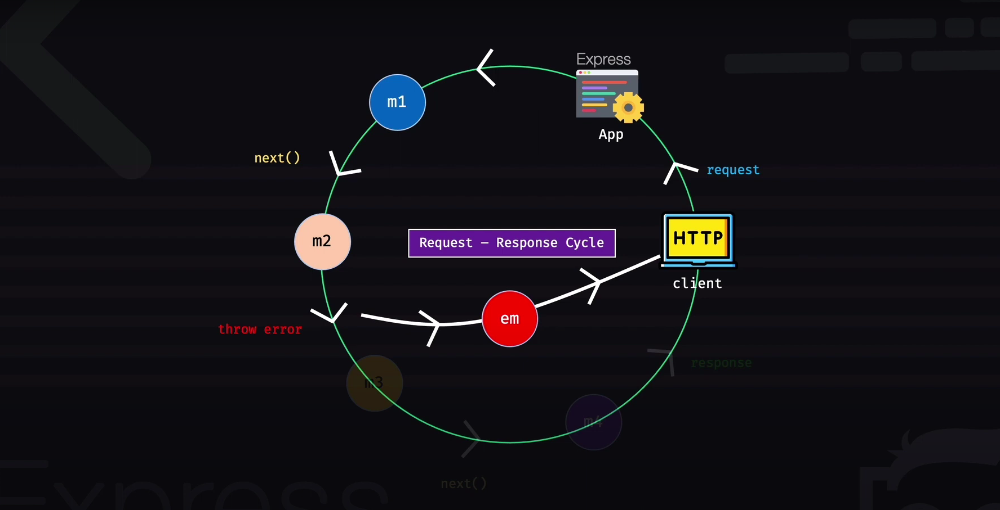

# Express Middleware

## Table of Contents
- [What is Middleware?](#what-is-middleware)
- [Request-Response Cycle with Middleware](#request-response-cycle-with-middleware)
- [The `next()` Function](#the-next-function)
- [What Can Middleware Do?](#what-can-middleware-do)
- [Types of Middleware in Express](#types-of-middleware-in-express)
- [Middleware Examples](#middleware-examples)
  - [Application-level Middleware](#1-application-level-middleware)
    - [Basic Middleware](#example-1-basic-middleware)
    - [Multiple Middleware](#example-2-multiple-middleware)
    - [Logger Middleware](#example-3-logger-middleware)
  - [Router-level Middleware](#2-router-level-middleware)
  - [Third-party Middleware](#3-third-party-middleware)
  - [Error-handling Middleware](#4-error-handling-middleware)
  - [Configurable Middleware](#5-configurable-middleware)

## What is Middleware?
Middleware functions are functions that have access to the `request` object (`req`), the `response` object (`res`), and the `next` function in the Express application's request-response cycle.

- They act like filters in the request-response cycle
- Middleware functions can perform a variety of tasks, modify the request and response objects, and control the flow of the application

## Request-Response Cycle with Middleware



- Any middleware can call the response functionality from its own execution path and choose not to call the `next()` function if needed, thus ending the response cycle
- Any middleware can throw an error. In that case, the `next()` function for subsequent middleware won't be called
- To handle errors properly, we should create a dedicated error handler middleware to catch and process errors in a modular way
- The error middleware can intercept errors thrown by other middlewares

> **What happens if you don't implement an error handling middleware?**  
> If any middleware throws an error and you don't have a mechanism to handle it (like an error handler middleware), your application will crash.

## The `next()` Function

Anything passed as a parameter to `next()` will be considered an error:

```javascript
const ex = (req, res, next) => {
    // Do something
    next('test'); // This will be treated as an error
}
```

**Output:**
- Console: `test` 
- Response: 500 Internal Server Error (sent with an HTML error page)

For successful middleware execution, `next()` should be called without arguments.

## What Can Middleware Do?

Middleware functions can:
- Execute any type of code
- Make changes to the `req` and `res` objects
- End the request-response cycle
- Call the next middleware by invoking `next()`
- Throw and catch errors

Example:
```javascript
function(req, res, next) {
    // Execute any type of code
    req.user = 'mofa'; 
    res.end(); // End response cycle
    next(); // Call next middleware
}
```

## Types of Middleware in Express

Based on their level of application:

1. **Application-level middleware**
2. **Router-level middleware**
3. **Error-handling middleware**
4. **Built-in middleware** (e.g., `express.json()`, `express.static()`)
5. **Third-party middleware** (e.g., cookie-parser)

Most packages provide different middleware functions for different tasks, which can be integrated at any point in your application.

## Middleware Examples

### 1. Application-level Middleware

#### Example 1: Basic Middleware

```javascript
const myMiddleware = (req, res, next) => {
    console.log('I am logging'); 
    next(); 
}; 

app.use(myMiddleware); // Tell the app to use this middleware
app.get('/about', (req, res) => {
    res.send('About'); 
}); 

app.listen(5000, () => {
    console.log("Listening on http://localhost:5000");
});
```

**Output:**
- Console: `I am logging`
- Response: `About`

> Note: You must call the `next()` function in `myMiddleware`. Since `app.use(middleware)` is written before the `app.get()` function, the app will use `myMiddleware` first. If you don't call `next()`, the application won't know what to do next and will hang.

#### Example 2: Multiple Middleware

```javascript
const app = express();

const myMiddleware1 = (req, res, next) => {
    console.log('I am logging1'); 
    next(); 
}; 

const myMiddleware2 = (req, res, next) => {
    console.log('I am logging2'); 
    next(); 
}; 

app.use(myMiddleware1); 
app.use(myMiddleware2); 

app.get('/about', (req, res) => {
    res.send('About'); 
});
```

**Output:**
- Console: 
  ```
  I am logging1
  I am logging2
  ```
- Response: `About`

#### Example 3: Logger Middleware

Creating a middleware that logs request information:

```javascript
const app = express();

const logger = (req, res, next) => {
    console.log(
        `${new Date(Date.now()).toLocaleString()} - ${req.method} - ${req.originalUrl} - ${req.protocol} - ${req.ip}`
    ); 
    next(); 
}

app.use(logger); // Apply to all routes
app.get('/about', (req, res) => {
    res.send('About'); 
}); 
```

**Output:**
- Console: `4/26/2025, 12:47:22 PM - GET - /about - http - ::1`
- Response: `About`

> Note: If you remove the `next()` call and put `res.end()`, you will get the console output but not the expected response.

### 2. Router-level Middleware

Creating a sub-application with its own middleware:

```javascript
const app = express();
const adminRouter = express.Router(); 

const logger = (req, res, next) => {
    console.log(
        `${new Date(Date.now()).toLocaleString()} - ${req.method} - ${req.originalUrl} - ${req.protocol} - ${req.ip}`
    ); 
    next(); 
}

adminRouter.use(logger); // Logger used only in adminRouter

adminRouter.get('/dashboard', (req, res) => {
    res.send("Dashboard");
});

app.use('/admin', adminRouter);

app.get('/about', (req, res) => {
    res.send('About'); 
}); 
```

> Important: The `adminRouter.use(logger)` should be placed above the routes of the `adminRouter` for this to work properly. Also, the `logger` function should be defined before the `adminRouter.use(logger)` line.

### 3. Third-party Middleware

Using cookie-parser middleware:

```javascript
import express from 'express'
import cookieParser from 'cookie-parser';

const app = express();
app.use(express.json()); // JSON parser (built-in middleware)
app.use(cookieParser()); // Third-party middleware at application level

app.post('/user/', (req, res) => {
    console.log(req.cookies);  
    res.send('Hello world'); 
});
```

### 4. Error-handling Middleware

Error handling middleware receives an additional `err` parameter before the standard `req`, `res`, and `next` parameters:

```javascript
const app = express();
const adminRouter = express.Router(); 

const logger = (req, res, next) => {
    console.log(
        `${new Date(Date.now()).toLocaleString()} - ${req.method} - ${req.originalUrl} - ${req.protocol} - ${req.ip}`
    ); 
    throw new Error("This is an error"); // Response will not end without error handling
}

adminRouter.use(logger);

adminRouter.get('/dashboard', (req, res) => {
    res.send("Dashboard");
});

app.use('/admin', adminRouter);

app.get('/about', (req, res) => {
    res.send('About'); 
}); 

const errorMiddleware = (err, req, res, next) => {
    console.log(err); // Show error in console  
    res.status(500).send("There was a server-side error"); // End the response
}

adminRouter.use(errorMiddleware); // Apply error handling middleware

app.listen(5000, () => {
    console.log("Listening on http://localhost:5000");
});
```

**Output:**
- Console: Error stack trace will be displayed
- Response: `There was a server-side error` (with 500 status code)

> Note: If you use `console.log(err.message)`, you'll see the error message "This is an error" in the console.

### 5. Configurable Middleware

Creating middleware that can be configured with options:

```javascript
const app = express();
const adminRouter = express.Router(); 

const loggerWrapper = (options) => {
    return function(req, res, next) {  // This is the logger function
        if (options.log) {
            console.log(
                `${new Date(Date.now()).toLocaleString()} - ${req.method} - ${req.originalUrl} - ${req.protocol} - ${req.ip}`
            ); 
            next(); // Call next() function
        } else {
            throw new Error("Failed to log"); 
        }
    };
};

// Use the configurable middleware
adminRouter.use(loggerWrapper({ log: true }));

adminRouter.get('/dashboard', (req, res) => {
    res.send("Dashboard");
});

app.use('/admin', adminRouter);

app.get('/about', (req, res) => {
    res.send('About'); 
}); 

const errorMiddleware = (err, req, res, next) => {
    console.log(err); // Show error in console  
    res.status(500).send("There was a server-side error"); // End the response
}

adminRouter.use(errorMiddleware);

app.listen(5000, () => {
    console.log("Listening on http://localhost:5000");
});
```

**Output (when log: true):**
- Console: `4/26/2025, 1:48:31 PM - GET - /admin/dashboard - http - ::1`
- Response: `Dashboard`


