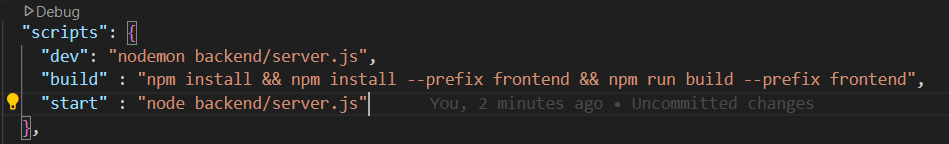

# Deployment Guide

## Current Environment
- Backend API application: `localhost:5000`
- Frontend React application: `localhost:5173`

## Deployment Goal
We want to make a way so that both (server and client) can be visited at -> `localhost:5000`

## Deployment Steps

### 1. Build the Frontend
- Run the command: `npm run build`

### 2. Update Server Configuration
- Go to server.js and add:
```javascript
import path from "path" 
const __dirname = path.resolve();
```

- Then add this code part:
```javascript
if(process.env.NODE_ENV === "production"){
    app.use(express.static(path.join(__dirname, "/frontend/dist"))) //__dirname will take to root and then
                                                                    //go to frontend and then dist

    app.get("*" , (req, res)=>{
        res.sendFile(path.resolve(__dirname, "frontend" , "dist" , "index.html")) ;
    })
}
```

### 3. Prepare for Deployment
- You can delete the node_modules in both frontend and backend (optional, good for GitHub).

### 4. Configure Build Process
To make the project deployable under localhost:5000:
- We will create a mechanism that, when we run the project (with npm run build) in the root folder, it will also run the frontend project as well.
- Go to package.json of the root project (not frontend or backend)

### 5. Update Root package.json Scripts
Add these to the scripts section:
```json
"build" : "npm install && npm install --prefix frontend && npm run build --prefix frontend"
```
- This installs npm packages for both backend (the first npm install) and frontend (the second npm install) and then runs the npm run build command.

Add start script:
```json
"start" : "node backend/server.js"
```

### 6. Configure Environment Variables
Before running npm run build, we need to specify NODE_ENV that we declared in the server.js file:

```json
"scripts": {
  "dev": "set NODE_ENV=development&& nodemon backend/server.js",
  "build": "npm install && npm install --prefix frontend && npm run build --prefix frontend",
  "start": "set NODE_ENV=production&& node backend/server.js"
}
```

**Note:** The && must be right after the environment variable definition without a space.

### 7. Run the Application
- Run the command in the root of the project folder: `npm run start` or `npm start`
- This will start both server and client

Your final scripts in the root project's package.json should look like this:


## Deploying to Render.com
1. Select "Deploy a web service"
2. Select the repo from the list
3. Set build command: `npm run build`
4. Set start command: `npm run start`
5. Fill in environment variables and other required fields


