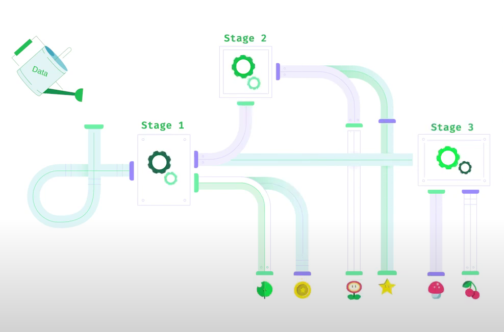
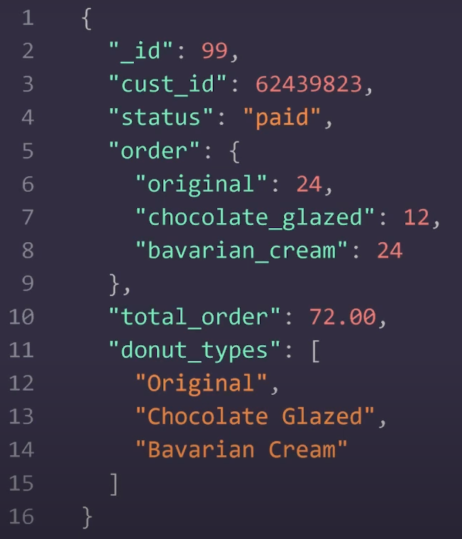

what is Aggregation Pipeline??

- Aggregation pipeline is a system of composable operations you can use to process your data. 


You can define different stages like in a factory production line where in each stage , a specific get removed to make the product more refined , more focused to users need , omitting extra unnecessary things. 
- this stages are arranged in a sequence that you create. Documents go through this stages, resulting in a transformed data set. 

- So a goode designed and powerful data pipelines can process complex data sets at scale . 




to understand the process fully , lets take an example - A e-commerce donut business where you want to know `How much you earned this week by analyzing how much each customers spent`


your db order documents are like this : 



- for this you can run an aggregation like this :

```
db.donutorders.aggregate([
    {$match : {status: 'paid'}} , //first stage

    {
        $group:{
            _id: "$cust_id", 
            total: {$sum: "$total_order"}
        }
    }

]); 
```
- first stage - filter by only paid order documents . 
- second stage - $group

    - $group needs something to group by(here this is customer_id ) and it will group them uniquely , one for one customer
    - second parameter is optional , where you can do anything. (here we did take an accumulator and sum up the tota_order values of each customers )

NOTE: 
 Aggregation pipelines run with the db.collection.aggregate() method do not modify documents in a collection, unless the pipeline contains a $merge or $out stage.


