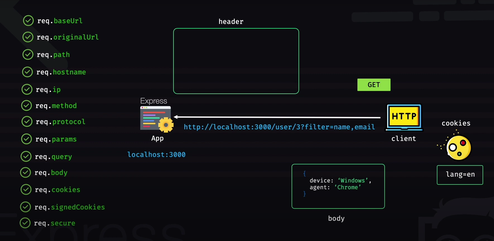
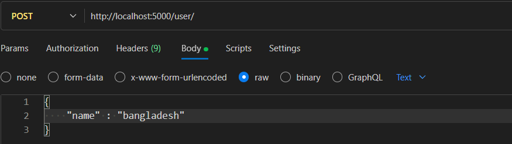
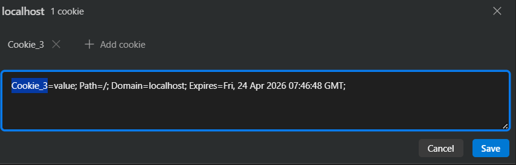
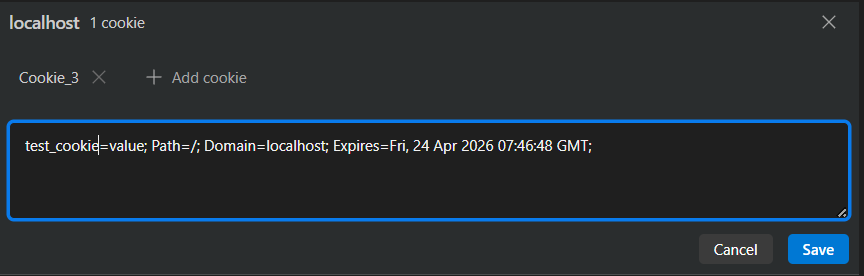
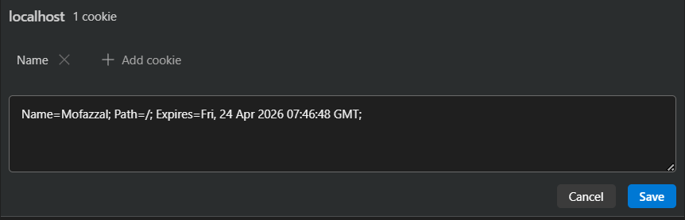
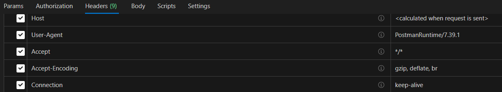

# Request Object in Express.js

## What is Request?

- When a client hits a particular URL or makes an HTTP/HTTPS request through a URL to the server.
- Represents the HTTP/HTTPS request.
- Known as `req` (as per convention)

## Visual Representation

**Client**: Mobile, browser, Postman or anything that can make a request to the server.  
**Server**: The Express app that is running on localhost:3000 in any server or our local machine (localhost:3000).



## Request Properties

1. `req.baseUrl`
2. `req.originalUrl`
3. `req.path`
4. `req.hostname` (in header object, 'Host' : 'localhost')
5. `req.ip`
6. `req.method` (GET, POST, PUT)
7. `req.protocol` (HTTP/HTTPS)
8. `req.params` (parameters in the request, as object, e.g. /user/3)
9. `req.query` (filter=name, email)
10. `req.body` (in POST, PUT method, we also send data in the body)
11. `req.cookies` (if there are any cookies with the request)
12. `req.signedCookies`
13. `req.secure` (true if HTTPS, false if HTTP request)
14. `req.app`
15. `req.route`

## Detailed Explanation with Code Examples

### `req.baseUrl`

#### Basic Usage
```javascript
const app = express();

app.get('/user/:id', (req, res) => {
    console.log(req.baseUrl); 
    res.send('Hello world'); 
}); 
```

**Request**: 
- Postman (GET) → `localhost:5000/user/5`

**Output**: 
- A blank URL will be shown in the console

#### With Subroutes
```javascript
const app = express();

const adminRoute = express.Router(); 

adminRoute.get('/dashboard', (req, res) => {
    console.log(req.baseUrl); //Now the baseUrl will be /admin
    res.send('We are in Admin dashboard');
});

app.use('/admin', adminRoute);  //to use the subapp

app.get('/user/:id', (req, res) => {
    console.log(req.baseUrl); 
    res.send('Hello world'); 
}); 
```

**Request**: 
- Postman (GET) → `localhost:5000/admin/dashboard`

**Output**: 
- `/admin`

**Notes**:
- When a subapp (adminRoute) is mounted on an app (app), then the baseUrl (/admin) of that subapp (adminRoute) will be the baseUrl for all the routes (adminRoute.get()) that are using that subapp.
- Same goes for the root app (app) here. The root app is mounted on the top. That is why, after the server URL (localhost:5000/), the baseUrl is blank for the root app (app).

### `req.originalUrl`

```javascript
const app = express();

const adminRoute = express.Router(); 

adminRoute.get('/dashboard', (req, res) => {
    console.log(req.originalUrl); 
    res.send('We are in Admin dashboard');
});

app.use('/admin', adminRoute); 

app.get('/user/:id', (req, res) => {
    console.log(req.originalUrl); 
    res.send('Hello world'); 
}); 
```

**Request Examples**:
- Postman (GET) → `localhost:5000/user/3?filter=name`
  - **Output**: `user/3?filter=name` (this is the originalUrl)
- Postman (GET) → `localhost:5000/admin/dashboard`
  - **Output**: `admin/dashboard`

**Notes**:
- OriginalUrl always shows the URL with respect to the root app (app), not from subapp.
- But req.baseUrl() shows the URL with respect to subapp.
- So originalUrl is recommended for better debugging.
- All this is important when you use subapp in the app (one or more subapp).

### `req.path`

**Request Examples**:
- If you hit `localhost:5000/admin/dashboard`
  - **Output**: `/dashboard` (because the URL of the subapp (adminRoute) is -> localhost:5000/admin)
- If you hit `localhost:5000/user/3?filter=name`
  - **Output**: `/user/3` (path that is defined in the server routes + filters are not path, these are query parameters)

### `req.params`

This will return the object which is a parameter in the URL.

```javascript
app.get('/user/:id', (req, res) => {
    console.log(req.params); 
    res.send('Hello world'); 
});
```

**Request**: 
- Postman (GET) → `http://localhost:5000/user/3?filter=name`

**Output**: 
- `{ id: '3' }` in the console

This is a valid JS object. So, if you do:
```javascript
console.log(req.params.id)
```
It will show `3` in the console.

### `req.query`

It doesn't concern with parameter (id), it's concerned with the query parameter in the URL.

```javascript
app.get('/user/:id', (req, res) => {
    console.log(req.query);
    res.send('Hello world'); 
});
```

**Request**: 
- Postman (GET) → `http://localhost:5000/user/3?filter=name`

**Output**: 
- `{ filter: 'name' }`

### `req.body`

**Request Setup**:
- Postman (POST) → `http://localhost:5000/user/`
- Set Content-Type to `application/json` in the Request Header
- Body (raw): `{"name": "bangladesh"}`



**Code Example**:
```javascript
app.post('/user/', (req, res) => {
    console.log(req.body); 
    res.send('Hello world'); 
});
```

**Initial Output**: 
- `undefined`

**Why?** 
Because we get the response of a request as a buffer in Node.js (so we have to get those buffers and convert them into strings). Express makes an easier way to do this. It makes different parsing functions (express.json(), express.urlencoded(), etc). We have to specify Express to use a particular parser (in this case, JSON parser).

**Updated Code**:
```javascript
const app = express();
app.use(express.json()); //this is the parsing function 

app.post('/user/', (req, res) => {
    console.log(req.body); 
    res.send('Hello world'); 
});
```

**Output After Adding Parser**: 
- `{"name": "bangladesh"}`

### `req.cookies`

Cookies can be in browser or client, but as we're using Postman, we will set and send cookies manually.
---
**NOTE:**
- only client with browser support(browser client) and server can set cookie. So the client have to be browser to be able to use cookie.

--- 

**Setting Cookies in Postman**:





**Code Example**:
```javascript
app.post('/user/', (req, res) => {
    console.log(req.cookies); 
    res.send('Hello world'); 
});
```

**Initial Request**: 
- Postman (POST) → `http://localhost:5000/user/`

**Initial Output**: 
- `undefined`

**Why?**
Because just like req.body, you have to set a parsing function for cookies too.

**Installing Cookie Parser**:
```bash
npm i cookie-parser
```

**Updated Code**:
```javascript
import express from 'express'
import cookieParser from 'cookie-parser';

const app = express();
app.use(express.json()); //json parser
app.use(cookieParser()); 

app.post('/user/', (req, res) => {
    console.log(req.cookies);  
    res.send('Hello world'); 
});
```

**Output with test_cookie**: 
- `{ test_cookie: 'value' }`

**After setting another cookie value**:


**Output**: 
- `{"name": "Mofazzal"}`

### `req.signedCookies`

If you use cryptographically secured cookies that cannot be tampered with, then these are called signed cookies.

### `req.secure`

Returns `true` if HTTPS, `false` if HTTP.

### `req.app`

Instead of doing everything in one file, you might want to do some functionalities in another file called handler.js and use the app object in that file. How will you access the app object in handler.js file?

Express does a very good job in this. Express sends the reference of the app object with the "request" object. You have to use `req.app`.

**Server.js**:
```javascript
import express from 'express';
import handle from './handle.js';

const app = express();

// Imagine this config is used across modules
app.set('myConfig', {
  appName: 'My Modular App',
  version: '1.0.0',
  author: 'Mofazzal',
});

app.get('/user', handle);
```

**Handle.js**:
```javascript
const handle = (req, res) => {
  // Access shared config from app
  const config = req.app.get('myConfig');

  console.log(`Modular system check: ${config.appName} by ${config.author}`);
  
  res.send(`Welcome to ${config.appName} (v${config.version})`);
};

export default handle;
```

**Request**: 
- Postman (GET) → `localhost:5000/user`

**Console Output**: 
- `Modular system check: My Modular App by Mofazzal`

**Browser Response**: 
- `Welcome to My Modular App (v1.0.0)`

### `req.route`

Gives all the information about a route.

**Request**: 
- Postman (POST) → `http://localhost:5000/user/3`

**Code**:
```javascript
app.get('/user/:id', (req, res) => {
    console.log(req.route);  
    res.send('Hello world'); 
}); 
```

## Request Methods

1. `req.accepts(types)`
2. `req.get()`

### `req.accepts(types)`

**Use-case**: Not all types of clients (mobile, desktop, etc.) accept all types of information as a response. 

By default, in the Header:


The "accept" parameter is set to `*/*`, which means accept all types of response information. For example, if the accept parameter is set to `application/json`, then the client will only accept JSON response.

So if the accept is set to "application/json", then:
```javascript
console.log(req.accepts('html')) // false 
console.log(req.accepts('json')) // json (if it matches, it will return the type)
```

**Example**: Imagine you want to send responses with EJS view engine (HTML type) to desktop clients and JSON response to mobile users. How can you check if clients receive EJS or JSON and send specific responses?

```javascript
app.get('/user', (req, res) => {
    if(req.accepts('html')) {
        res.render("index")  // index.html is in the views page (MVC architecture)
    } else {
        res.send('hello world');  // this is JSON object
    }
})
```

### `req.get()`

Used to get information about the headers.

```javascript
app.get('/user', (req, res) => {
    console.log(req.get('content-type')); 
}); 
```

**Output**: 
- `application/json` (or any value that you've set)

## Advanced Request Object Tips and Examples

### Testing Request Objects

When developing with Express.js, properly testing request handling is crucial. Here are some practical approaches:

#### Using Postman Collections for API Testing

Creating a Postman collection for your API endpoints helps with consistent testing:

1. **Create environment variables** in Postman for base URL, auth tokens, etc.
2. **Save request examples** for each endpoint
3. **Use pre-request scripts** to generate dynamic data:
   ```javascript
   // Pre-request Script in Postman
   pm.environment.set("timestamp", new Date().getTime());
   pm.environment.set("random_id", Math.floor(Math.random() * 10000));
   ```
4. **Use tests to validate responses**:
   ```javascript
   // Tests in Postman
   pm.test("Status code is 200", function () {
       pm.response.to.have.status(200);
   });
   
   pm.test("Body contains expected data", function () {
       pm.expect(pm.response.json().name).to.eql("bangladesh");
   });
   ```

#### Unit Testing with Jest and Supertest

For automated testing of request handling:

```javascript
const request = require('supertest');
const express = require('express');
const app = express();

// Setup your routes
app.use(express.json());
app.post('/user', (req, res) => {
  if (!req.body.name) {
    return res.status(400).json({ error: 'Name is required' });
  }
  return res.status(201).json({ message: 'User created', name: req.body.name });
});

// Test cases
describe('POST /user', () => {
  it('should create a new user when valid data is provided', async () => {
    const response = await request(app)
      .post('/user')
      .send({ name: 'bangladesh' })
      .set('Content-Type', 'application/json');
    
    expect(response.statusCode).toBe(201);
    expect(response.body.name).toBe('bangladesh');
  });
  
  it('should return 400 when name is missing', async () => {
    const response = await request(app)
      .post('/user')
      .send({})
      .set('Content-Type', 'application/json');
    
    expect(response.statusCode).toBe(400);
  });
});
```

### Useful Request Object Properties and Methods

#### `req.xhr` - Detect AJAX Requests

```javascript
app.get('/data', (req, res) => {
  if (req.xhr) {
    // This is an AJAX request
    return res.json({ data: 'Some data' });
  }
  // Regular browser request
  return res.render('data-page');
});
```

#### `req.subdomains` - Access Subdomains

Useful for routing based on subdomain:

```javascript
app.get('/', (req, res) => {
  console.log(req.subdomains); // If URL is blog.example.com, this will output ["blog"]
  
  if (req.subdomains.includes('api')) {
    // Handle API subdomain
    return res.json({ version: '1.0' });
  }
  
  res.send('Main website');
});
```

#### `req.is()` - Content Type Checking

Check if the request's Content-Type matches a given type:

```javascript
app.post('/upload', (req, res) => {
  if (req.is('multipart/form-data')) {
    // Handle file upload
  } else if (req.is('application/json')) {
    // Handle JSON payload
  } else {
    res.status(415).send('Unsupported Media Type');
  }
});
```

### Best Practices for Request Handling

#### Validate Request Data

Always validate incoming request data to prevent security issues:

```javascript
const { body, validationResult } = require('express-validator');

app.post('/user',
  // Validation rules
  body('name').isString().trim().isLength({ min: 2 }),
  body('email').isEmail().normalizeEmail(),
  
  // Request handler
  (req, res) => {
    // Check for validation errors
    const errors = validationResult(req);
    if (!errors.isEmpty()) {
      return res.status(400).json({ errors: errors.array() });
    }
    
    // Process valid request
    res.status(201).json({ user: req.body });
  }
);
```

#### Handle File Uploads with Multer

```javascript
const multer = require('multer');
const upload = multer({ 
  dest: 'uploads/',
  limits: { fileSize: 1000000 }, // 1MB limit
});

app.post('/profile', upload.single('avatar'), (req, res) => {
  // req.file contains the uploaded file details
  console.log(req.file);
  
  // req.body contains the text fields
  console.log(req.body);
  
  res.send('File uploaded');
});
```

#### Debugging Request Objects

Add this middleware to log all incoming requests during development:

```javascript
app.use((req, res, next) => {
  console.log('----------------------------------------');
  console.log(`${new Date().toISOString()} - ${req.method} ${req.originalUrl}`);
  console.log('Query:', req.query);
  console.log('Params:', req.params);
  console.log('Body:', req.body);
  console.log('Headers:', req.headers);
  console.log('----------------------------------------');
  next();
});
```

### Security Considerations

#### Using Helmet for Secure Headers

```javascript
const helmet = require('helmet');
app.use(helmet());
```

This adds various HTTP headers to help protect against common attacks.

#### Rate Limiting to Prevent Abuse

```javascript
const rateLimit = require('express-rate-limit');

const apiLimiter = rateLimit({
  windowMs: 15 * 60 * 1000, // 15 minutes
  max: 100, // limit each IP to 100 requests per windowMs
  message: 'Too many requests, please try again later.'
});

// Apply to all requests
app.use('/api/', apiLimiter);
```

#### CORS Configuration for API Security

```javascript
const cors = require('cors');

// Simple usage (allow all origins)
app.use(cors());

// Or configure with options
app.use(cors({
  origin: 'https://example.com',
  methods: ['GET', 'POST'],
  allowedHeaders: ['Content-Type', 'Authorization'],
  credentials: true
}));
```

### Performance Tips

#### Using Compression Middleware

Compress response bodies for improved performance:

```javascript
const compression = require('compression');
app.use(compression());
```

#### Request Caching Strategies

```javascript
const cache = require('memory-cache');

app.get('/api/products', (req, res) => {
  const cacheKey = 'products';
  const cachedData = cache.get(cacheKey);
  
  if (cachedData) {
    return res.json(cachedData);
  }
  
  // If not cached, get data from database
  getProductsFromDatabase().then(products => {
    // Cache for 5 minutes
    cache.put(cacheKey, products, 5 * 60 * 1000);
    res.json(products);
  });
});
```

#### Handling Large Request Bodies

When dealing with large request bodies, consider increasing the limit:

```javascript
app.use(express.json({ limit: '50mb' }));
app.use(express.urlencoded({ limit: '50mb', extended: true }));
```

However, for file uploads, Multer with limits is a safer option as shown earlier.

### Common Troubleshooting

#### req.body is undefined

Check that:
1. The correct Content-Type header is set in the request
2. Body parser middleware is applied **before** your routes
3. The order of middleware matters in Express.js

```javascript
// CORRECT ORDER
app.use(express.json());
app.use(express.urlencoded({ extended: true }));
app.use('/api', apiRoutes);

// INCORRECT ORDER - would cause req.body to be undefined in apiRoutes
app.use('/api', apiRoutes);
app.use(express.json());
```

#### Cookies Not Being Received

Ensure cookie-parser is configured correctly:

```javascript
const cookieParser = require('cookie-parser');

// For unsigned cookies
app.use(cookieParser());

// Or with a secret for signed cookies
app.use(cookieParser('your-secret-key'));

// Then access signed cookies with:
app.get('/profile', (req, res) => {
  console.log(req.signedCookies); // For signed cookies
  console.log(req.cookies); // For regular cookies
});
```

Remember that HttpOnly cookies cannot be accessed by client-side JavaScript, which is a security best practice for sensitive cookies.


