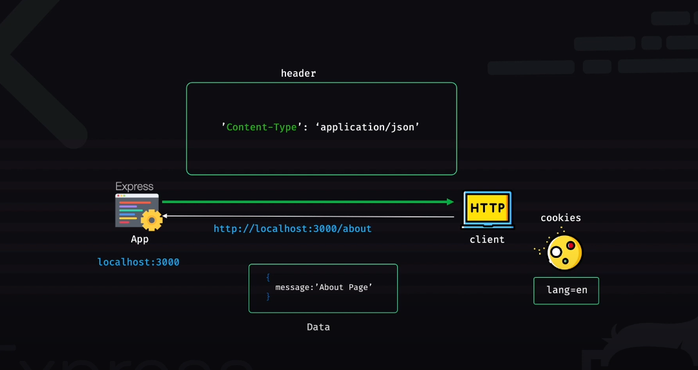

# Response Object

## Request-Response Mechanism (Visual)
- Blue arrow - request 
- Green arrow - response



Only browser client can set cookies (so cookie is set in browser client, set by server through HTTP response or browser can set it manually with JS).
Express app can also send data with the response.

## Properties

### res.app
- Same as req.app

### res.headersSent
- After sending header one time, if you try to send again, it will return false 

### res.locals
- For local variables
- Local variables scoped to the Response
- As HTTP is a stateless variable, so it is applicable or this local variables can be used only in 'views' or template engine views only

## Methods

### res.cookie()
- To set cookie name to value

### res.clearCookie()
- Clear cookies by name

### res.end()
- End the response process
- Disconnected with the client

### res.send()
- Sends the HTTP response
- To send data with the response

### res.json()
- Sends a JSON response

### res.status()
- To set the HTTP status

### res.sendStatus()
- Sets the status code and also the status data will be sent to the client after ending the response

### res.render()
- View rendering 
- Render a view

### res.format()
- In req.accepts, you can check the acceptable content-type that the client accepts
- With res.format(), you can perform content-negotiation on the Accept HTTP header on Request object. That means it can read the content the client sends and format the response accordingly
- Example, if the client says that it only accepts application/json content-type, res.format can read it and send response of this type

### res.location()
- Set a location named header with a URL value to the response, so that the client would know where to redirect, but don't redirect

### res.redirect()
- Redirect the URL derived from the specified path

## Explanation with Code

### res.locals
- You need a view engine first to work with this

Install EJS engine:
```
npm install ejs
```

Code:
```javascript
const app = express();
app.set('view engine', 'ejs');

app.get('/about', (req, res) => {
    res.render('pages/about', { //in the second parameter you're sending data in an object that you will catch with res.locals in the about page
        name: 'Bangladesh',
    }); 
}); 
```

The whole object:
```javascript
{
    name: "Bangladesh"
}
```
will be stored in res.locals.

Now create the About page in views/pages/about.ejs and write this code:
```html
<!DOCTYPE html>
<html lang="en">
  <head>
    <meta charset="UTF-8">
    <meta name="viewport" content="width=device-width, initial-scale=1.0">
    <meta http-equiv="X-UA-Compatible" content="ie=edge">
    <title>HTML 5 Boilerplate</title>
    <link rel="stylesheet" href="style.css">
  </head>
  <body>
    This is about page <%= name %> <!-- here you are catching and showing it in the about page -->
  </body>
</html>
```

Output: `This is about page Bangladesh`

### res.headersSent

```javascript
const app = express();
app.set('view engine', 'ejs');

app.get('/about', (req, res) => {
    console.log(res.headersSent);  // will be false as header is not sent with response
    res.render('pages/about', { 
        name: 'Bangladesh',
    }); 
    console.log(res.headersSent);  // already sent
}); 
```

Postman(GET): `localhost:5000/about`

Output:
```
false 
true
```

### res.end()
- To close a response (without data to end a response)

### res.send()
- To send a response with data 

```javascript
const app = express();
app.set('view engine', 'ejs');

app.get('/about', (req, res) => {
    res.send('This is about page');
    res.end();
}); 
```

### res.json()
- Response will be given after doing JSON.stringify()
- Can send JSON object or array as response (will be converted to string before response)

```javascript
const app = express();
app.set('view engine', 'ejs');

app.get('/about', (req, res) => {
    res.json({
        name: "bangladesh",
    });
});
```

### res.sendStatus()
- Will execute both:
  - res.status(200) - setting status code 
  - res.end() - to end response

And also the status code and their corresponding text meaning like for res.sendStatus(400) it will send:
- 400 bad request 
- Also the textual -> Bad request 
- And response end

If you use only res.status(), the response will not end. So you have to end it manually. But if you use res.sendStatus(), then the status setting and response ending will happen one after another.

### res.format()
- Content-negotiation with request. If there's any accepts header with the request from the client, then res.format does content-negotiation and sends appropriate response

Request -> Content-type -> application/json
So the client wants JSON type data, then the res.format will negotiate and understand it and send application/json type data (actually you have to define what types of data you want to send accordingly with different conditions).

```javascript
app.get('/about', (req, res) => {
    res.format({
        'text/plain': () => {
            res.send('sending text/plain data as the client request text/plain data');
        },
        'text/html': () => {
            res.render('page/about');
        },
        'application/json': () => {
            res.json({
                name: "Bangladesh",
            });
        },
        default: () => {  // cannot be given as string ('default')
            res.status(406).send("Not acceptable");
        }
    });
});
```

All this works if there is `accept` in the header parameter.

### res.cookie()
- To set cookie with name to value
- You have to end the response after setting

```javascript
app.get('/about', (req, res) => {
    res.cookie('name', 'bangladesh'); // you can also send other things as 3rd parameter (see documentation)
    res.end();
}); 
```

Now you'll see a cookie is set in the response section of the postman with the name and value that you've set.

### res.location()
```javascript
app.get('/about', (req, res) => {
    res.location('/landing');
}); 
```

In the response section's header of postman, you'll see a new name called location with value /landing.

### res.redirect()
- It will actually redirect (not just set in the header)

```javascript
app.get('/test', (req, res) => {
    res.send('hello');
}); 

app.get('/about', (req, res) => {
    res.redirect('/test');
    res.end();
}); 
```

In the output: `hello`


