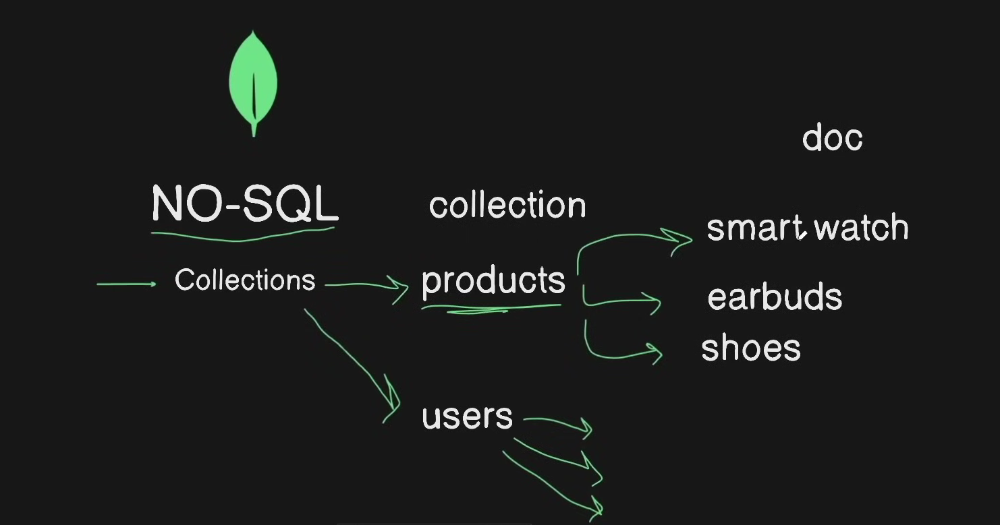
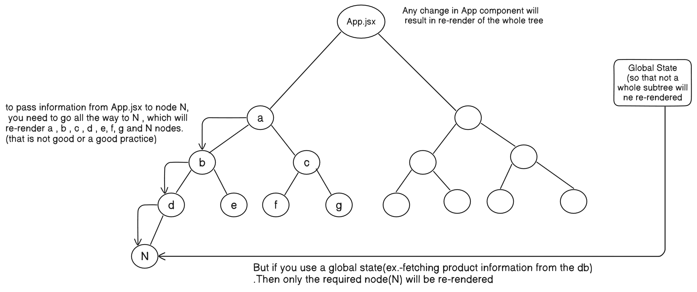
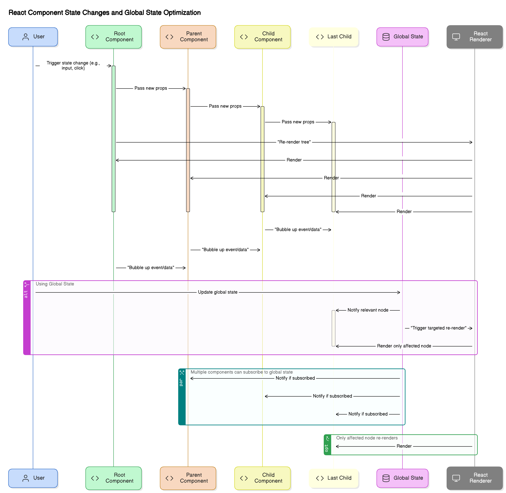

# MERN Stack Crash Course

A comprehensive guide for setting up and using Express.js in a MERN stack application.

## Table of Contents

1. [Project Setup](#project-setup)
2. [Backend Development](#backend-setup)
   - [Server Setup](#backend-setup)
   - [MongoDB Database Setup](#mongodb-database-setup)
     - [Create Connection String](#create-connection-string)
     - [Set Network Access](#set-network-access)
     - [Access MongoDB](#access-mongodb)
     - [Create Database Connection](#create-database-connection)
     - [NoSQL Database Structure](#nosql-database-structure)
     - [Creating Data Models](#creating-data-models)
   - [Project Modularization](#modularizing-project)
     - [Routes](#modularizing-project)
     - [Controllers](#modularizing-project)
     - [Models](#modularizing-project)
     - [Flow Diagram](#modularizing-project)
3. [Frontend Development](#frontend-setup)
   - [Vite Setup](#frontend-setup)
   - [Chakra UI Integration](#frontend-setup)
   - [Backend Connection](#frontend-setup)
   - [Routing Setup](#frontend-setup)
   - [State Management with Zustand](#frontend-setup)
  <br><br>


<a id="project-setup"></a>
## Project Setup


- Initialize the project in the main root folder (not in the backend or frontend)
  ```bash
  npm init -y
  ```

- Install dependencies
  ```bash
  npm install express mongoose dotenv
  ```
  (express for web framework and routing)

<a id="backend-setup"></a>
## Backend Development

### Server Setup

- Create server.js in the backend folder (the main entry point of our app)

- We won't be using the commonjs but the module package to import stuff. So go to 
  package.json-> add another field called "type" : "module"

- Also in the script section, add:
  ```json
  "dev" : "node backend/server.js"
  ```

- Then run:
  ```bash
  npm run dev
  ```

- Now to make the server autorefresh everytime for any change, install nodemon package as devDependencies
  ```bash
  npm i nodemon -D
  ```

- Then change the script:
  ```json
  "dev" : "nodemon backend/server.js"
  ```

<a id="mongodb-database-setup"></a>
### MongoDB Database Setup

Now setting up the database: (mongoose is already installed)

<a id="create-connection-string"></a>
#### Create Connection String

1. Create a MongoDB connection string and copy the database user password and place it in .env file
2. Name the database in the cluster string:
   - In the connection string, before the ? mark, set the db name 
   ```
   ___________@cluster0.badfsf.mongodb.net/?_________
   ```
   - Write the db name as products 
   ```
   ___________@cluster0.badfsf.mongodb.net/products?_________
   ```

<a id="set-network-access"></a>
#### Set Network Access

- Now go to Security -> Network Access -> you'll see your IP as listed 
  - Now add IP address -> allow access from anywhere (which will make the access list entry to 0.0.0.0/0) 

<a id="access-mongodb"></a>
#### Access MongoDB in Your Application

- But you can't access it from the server.js or any other files (that is why we installed dotenv)
- To use the mongo_uri in the .env file, use
  `import dotenv from "dotenv";`
  and then you can use it. To see this in the console with server.js:

```javascript
import dotenv from 'dotenv';
dotenv.config();
console.log(process.env.MONGO_URI);
```

Console output: mongodb url from the .env file 

<a id="create-database-connection"></a>
#### Create Database Connection Module

- Now create a config/db.js in the backend directory:
```javascript
import mongoose from "mongoose";
import dotenv from "dotenv"; 

dotenv.config(); 

export const connectDB = async () => {
    try {
        const conn = await mongoose.connect(process.env.MONGO_URI); 
        console.log(`MongoDB Connected: ${conn.connection.host}`);
    } catch (error) {
        console.error(`Error: ${error.message}`); 
        process.exit(1); // process code 1 means exit with failure, 0 means success
    }
}
```

<a id="nosql-database-structure"></a>
#### NoSQL Database Structure



<a id="creating-data-models"></a>
#### Creating Data Models

- Now we will create a product model in models/product.model.js (.model is just a convention, file is still just a js file. You can also follow the Product.js convention to create schema)

```javascript
import mongoose from 'mongoose'; 

const productSchema = new mongoose.Schema({
    name: {
        type: String, 
        required: true
    }, 
    price: {
        type: Number, 
        required: true
    }, 
    image: {
        type: String,
        required: true
    },
}, {
    timestamps: true // createdAt, updatedAt
}); 

const Product = mongoose.model('Product', productSchema); 
export default Product; 
```

#### Important Notes on Mongoose Models:

- In the last two lines:
  `const Product = mongoose.model('Product', productSchema);` 
  - This is saying to mongoose that you should create a model called 'Product', which will follow this `productSchema` structure/schema and you should assign it to an object called Product. You should write the 'Product' in the model() function like this - first letter uppercase and the word is singular. MongoDB will make it - products or you can say - lowercase and plural. You can see the database collection as `products` in the mongodb cloud.
  
  `export default Product;` 
  - As we're exporting only one object Product from this file.
  
- The `timestamps: true` option will automatically keep createdAt and updatedAt data


<a id="modularizing-project"></a>
### Project Modularization

- Create routes/product.route.js (also a convention, you can create like product.js) and move all the routes related to products into this file 

**product.route.js:**
```javascript
import express from 'express'; 
import mongoose from 'mongoose'; 
import Product from '../models/product.model.js';

const router = express.Router(); // making a router for product routes only

router.get('/', async (req, res) => {
    try {
        const products = await Product.find({}); 
        res.status(200).json({success: true, data: products}); 
    } catch (error) {
        console.log("Error fetching products: ", error.message); 
        res.status(500).json({success: false, message: "server error"}); 
    }
}); 

router.post('/', async (req, res) => {  // it should be an async function to use 'await'
    const product = req.body; 

    if (!product.name || !product.price || !product.image) {
        return res.status(400).json({success: false, message: "Please provide all the necessary fields"}); 
    }

    const newProduct = new Product(product); // use the schema model to create the product 

    // now save the model 
    try {
        await newProduct.save(); 
        res.status(201).json({success: true, data: newProduct}); 
    } catch (error) {
        console.error("Error in create Product: ", error.message); 
        res.status(500).json({success: false, message: "Server Error"}); 
    }
}); 

router.put('/:id', async (req, res) => {
    const {id} = req.params; 
    const product = req.body; // receives the updated product information 

    if (!mongoose.Types.ObjectId.isValid(id)) {
        return res.status(404).json({success: false, message: "Invalid Product id"}); 
    }

    try {
        const updatedProduct = await Product.findByIdAndUpdate(id, product, {new: true}); 
        res.status(200).json({success: true, data: updatedProduct}); 
    } catch (error) {
        res.status(500).json({success: false, message: "Server Error"}); 
    }
}); 

router.delete('/:id', async (req, res) => {
    const {id} = req.params; // productId should be an object (must be in {} braces)
    try {
        console.log(id); 
        await Product.findByIdAndDelete(id); 
        res.status(200).json({success: true, message: "Product Deleted"}); 
    } catch (error) {
        res.status(404).json({success: false, message: "Product not found"}); 
    }
}); 

export default router;
```

**server.js:**
```javascript
import express from 'express';
import productRouter from './routes/product.route.js';
import { connectDB } from './config/db.js';

const app = express();
app.use(express.json()); // using a json parser to parse json data in req.body

app.use('/api/products', productRouter); // routes to products related API 

app.listen(5000, () => {
    connectDB(); 
    console.log("listening on http://localhost:5000");
});
```

- But the product route is still so much messy with all the controller functions. So we can make some more modular changes to make the app more modular

To do that: 

- Create controllers/product.controller.js (also another convention, you can create like controllers/product.js) and 
paste all the controller functions in the API methods:

**product.controller.js:**
```javascript
import mongoose from 'mongoose'; 
import Product from '../models/product.model.js';

export const getProducts = async (req, res) => {
    try {
        const products = await Product.find({}); 
        res.status(200).json({success: true, data: products}); 
    } catch (error) {
        console.log("Error fetching products: ", error.message); 
        res.status(500).json({success: false, message: "server error"}); 
    }
}; 

export const createProduct = async (req, res) => {  // it should be an async function to use 'await'
    const product = req.body; 

    if (!product.name || !product.price || !product.image) {
        return res.status(400).json({success: false, message: "Please provide all the necessary fields"}); 
    }

    const newProduct = new Product(product); // use the schema model to create the product 

    // now save the model 
    try {
        await newProduct.save(); 
        res.status(201).json({success: true, data: newProduct}); 
    } catch (error) {
        console.error("Error in create Product: ", error.message); 
        res.status(500).json({success: false, message: "Server Error"}); 
    }
}; 

export const updateProduct = async (req, res) => {
    const {id} = req.params; 
    const product = req.body; // receives the updated product information 

    if (!mongoose.Types.ObjectId.isValid(id)) {
        return res.status(404).json({success: false, message: "Invalid Product id"}); 
    }

    try {
        const updatedProduct = await Product.findByIdAndUpdate(id, product, {new: true}); 
        res.status(200).json({success: true, data: updatedProduct}); 
    } catch (error) {
        res.status(500).json({success: false, message: "Server Error"}); 
    }
}; 

export const deleteProduct = async (req, res) => {
    const {id} = req.params; // productId should be an object (must be in {} braces)
    try {
        console.log(id); 
        await Product.findByIdAndDelete(id); 
        res.status(200).json({success: true, message: "Product Deleted"}); 
    } catch (error) {
        res.status(404).json({success: false, message: "Product not found"}); 
    }
}; 
```

Now the product.route.js will be like this, more structured and organized:
```javascript
import express from 'express'; 
import { createProduct, getProducts, updateProduct, deleteProduct } from '../controllers/product.controller.js';

const router = express.Router(); // making a router for product routes only

router.get('/', getProducts); 
router.post('/', createProduct); 
router.put('/:id', updateProduct); 
router.delete('/:id', deleteProduct); 

export default router;
```

- Now everything is more modular and organized. 

#### Flow Diagram of the Modular Project Structure

Below is a visual representation of how API requests flow through the different components of our modular backend structure:

```
┌───────────────┐     ┌───────────────────┐     ┌──────────────────────┐     ┌─────────────────┐
│               │     │                   │     │                      │     │                 │
│  API Request  │────▶│    server.js      │────▶│  product.route.js    │────▶│product.controller│
│   (Client)    │     │  (Entry Point)    │     │  (Route Handlers)    │     │ (Business Logic)│
│               │     │                   │     │                      │     │                 │
└───────────────┘     └───────────────────┘     └──────────────────────┘     └────────┬────────┘
                                │                                                      │
                                ▼                                                      ▼
                      ┌───────────────────┐                               ┌─────────────────────┐
                      │                   │                               │                     │
                      │    config/db.js   │                               │  product.model.js   │
                      │(Database Connect) │                               │   (Data Schema)     │
                      │                   │                               │                     │
                      └───────────────────┘                               └─────────────────────┘
                                │                                                      │
                                ▼                                                      ▼
                      ┌───────────────────┐                               ┌─────────────────────┐
                      │                   │                               │                     │
                      │    MongoDB        │◀──────────────────────────────│   CRUD Operations   │
                      │   (Database)      │                               │                     │
                      │                   │                               │                     │
                      └───────────────────┘                               └─────────────────────┘

Flow:
1. Client sends HTTP request to server
2. server.js routes requests to appropriate router (product.route.js)
3. product.route.js dispatches to appropriate controller function
4. Controller uses the Product model to interact with database
5. Database operations are performed
6. Response flows back through the same path to the client
```

<a id="frontend-setup"></a>
## Frontend Development

### Vite Setup

in the terminal :
cd ./frontend

and then 
npm create vite@latest .   
(you have to put the . (dot) to indicate the current folder)
select - react and then javascript
and then: 
npm install
and then
npm run dev


### Chakra UI Integration

Now install chakra ui component library for Vite application in the frontend directory : 
npm i @chakra-ui/react @emotion/react


then go to main.jsx and wrapp the App component with ChakraProvider 

```
import { StrictMode } from 'react'
import { createRoot } from 'react-dom/client'
import { ChakraProvider, createSystem, defaultConfig } from "@chakra-ui/react"

import App from './App.jsx'

// Create the default system for Chakra UI v3
const system = createSystem(defaultConfig)

createRoot(document.getElementById('root')).render(
  <StrictMode>
    <ChakraProvider value={system}>  //passing the created system with Default config using value prop
      <App />
    </ChakraProvider>
  </StrictMode>,
)
```


Now delete index.css and App.css file, assets/ folder (we won't be needing them).


Now in the App.jsx , delete everything and paste this to check -
```
import { Button } from "@chakra-ui/react"


function App() {
  const [count, setCount] = useState(0)

  return (
    <>
      <Button>Hello world</Button>
    </>
  )
}

export default App

```
Now run the frontend application(must be in frontend directory):

npm run dev


open localhost:5173/ (or the specified port)


### Backend Connection

Now making connection with the backend and url setup :

go to vite.config.js and set the server : 

```
    server:{
      proxy: {
        "/api" :{
          target: "http://localhost:5000"
        }
      }
    }
```

Now whenever we visit "/api" , it will prefix it with  http://localhost:5000 and making it like http://localhost:5000/api

we will be needing this when making a global state in the store/product.js file


### Routing Setup

as react is single page and we need multiple page for the project , we need BrowserRouter to wrap the app . 
for that install a package: 
npm install react-router-dom


and wrap the App component with BrowserRouter ->
```
<BrowserRouter>
      <ChakraProvider value={system}>
        <App />
      </ChakraProvider>
    </BrowserRouter>


```


setting up the Navbar and routes of different pages : 

create src/components/Navbar.jsx and src/pages/HomePage.jsx and src/pages/CreatePage.jsx and then define the routes and Navbar in App.jsx ->
```javascript
import {Box} from "@chakra-ui/react" ; 
import {Route , Routes} from 'react-router-dom' ;  


import Navbar from './components/Navbar'
import HomePage from './pages/HomePage'
import CreatePage from './pages/CreatePage'


function App() {
  return (
    <Box minH="100vh">
      <Navbar/>
      <Routes>
        <Route path ="/" element={<HomePage/>} />
        <Route path = "/create" element={<CreatePage/>}/>

      </Routes>
    </Box>
  )
}

export default App ; 
```

some additional package installation :(just like before , frontend packages need to be installed in the frontend directory) 


for PlusSquareIcon or other icons , :
```
npm i react-icons
npm i @chakra-ui/icons
npm i zustand
```


### State Management with Zustand

Now we'll be using a global state when fetching information from the database . Because in React , a slight change in the root or any component will result in the change or re-render of its all child components . So if we have a global state and if we need any information , then we can fetch it from there. 




- In this project , we are doing it in the store/product.js to make a global state(in this case, zustand) and fetch product data from the database.


- Below is the example of creating a global state that will create products in the database for any components that needs the state. 
product.js
```javascript
import {create} from 'zustand' ; 

export const useProductStore = create((set)=>{
  product :[] ; 
  setProducts: (products)=>((products)),
  createProduct: async (newProduct)=>{

    //success: false
    if(!newProduct.name|| !newProduct.image||!newProduct.price){
      return {success:false , message: "Please fill in all the fields"} ; 
    }

    //success:true
    const res = await fetch("/api/products" , {
      method: "POST" , 
      headers: {
        "Content-Type": "application/json",
      },
      body: JSON.stringify(newProduct),
    });
    const data = await res.json() ; 
    set((state) =>({products: {...state.products, data.data}})) ; 

    return {success: true , message: "Product created Successfully"} ; 
  },

  //other methods
  // fetchProducts : 
  //updateProduct:
  //DeleteProduct: 


})
```

now this useProductStore global state can be used in any component like this 
```javascript
function ComponentName(){
  const {products} = useProductStore() ; 
  // 
  // 
  // 
}
```


- like that you can also create global state for fetchProducts , updateProducts and deleteProducts by defining functions in the useProductStore global state in the product.js file.This is both modular and also efficient.

When you want to use it , just make a state variable with the function from the useProductStore()  in the specified component where you want to use it like this ---


```javascript
function ComponentName(){
   
  const {fetchProducts, products} = useProductStore() ; 
  const{deleteProduct} = useProductStore() ; 
  // 
  // 
  // 
}
```


